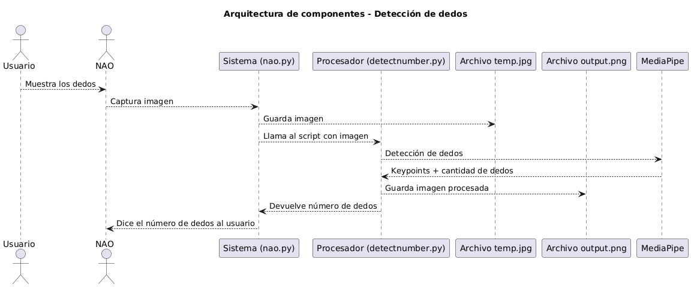

# 🤖Detección de dedos con NAO
## 🎥 Video de demostración

El siguiente video explica el objetivo del proyecto y muestra cómo el NAO integra el sistema para realizar la acción solicitada:  
👉 [Ver video en YouTube](URL_DEL_VIDEO)

## 🎯 Objetivo de la implementación
<!-- Completa aquí tu objetivo -->
<!-- Ejemplo: Detectar la cantidad de dedos levantados por el usuario frente al NAO y responder en voz alta -->
...


## 🛠 Herramienta utilizada para la conexión
> Para gestionar la conexión con el NAO y facilitar la ejecución de los scripts, se utilizó **Choregraphe** como entorno oficial de NAO.


## 🗂 Componentes de la arquitectura de la implementación

- **Usuario**: Persona que muestra los dedos frente al robot NAO.

- **NAO (hardware)**: Robot que captura la imagen mediante su cámara y comunica el resultado por voz al usuario.

- **Sistema (nao.py)**: 
  - Captura la imagen desde el NAO y la guarda en un archivo temporal (`temp.jpg`).
  - Llama al procesador (script `detectnumber.py`) para analizar la imagen.
  - Recibe el número de dedos detectado y hace que el NAO lo diga en voz alta.

- **Procesador (detectnumber.py)**:
  - Procesa la imagen con **MediaPipe Hands**.
  - Detecta los keypoints de la mano y calcula el número de dedos levantados.
  - Dibuja los puntos clave y el conteo sobre la imagen y la guarda como `output.png`.
  - Devuelve el número de dedos al sistema.

- **MediaPipe**:
  - Framework que identifica y devuelve los puntos clave de la mano.

- **Archivos**
  - `temp.jpg`: Imagen capturada por el NAO.
  - `output.png`: Imagen procesada con keypoints y el número de dedos detectado.


## ⚙ Instrucciones de instalación del modelo de IA en el Robot NAO

⚠ En esta propuesta no se requiere un modelo de IA entrenado específico (como un `.pkl` o `.h5`), ya que usamos **MediaPipe**, que es un framework preentrenado.

Lo que debes hacer en el entorno donde corres los scripts conectados al NAO:

1️⃣ **Instala las dependencias**
```bash
pip install mediapipe opencv-python
```
2️⃣ Asegúrate de tener el SDK de NAO

Instala pynaoqi compatible con tu NAO y tu versión de Python 2.7 para nao.py.

3️⃣ Despliegue

Coloca los scripts nao.py y detectnumber.py en el entorno donde el NAO puede ser controlado (puede ser tu PC conectada al NAO).

Configura la IP y puerto del NAO en nao.py para que apunten al robot real.

Ejecuta:
```
python nao.py
```
Esto iniciará el flujo: captura la imagen, detecta los dedos y el NAO dice el resultado.


## 🚀 Cómo usar
1️⃣.  Muestra los dedos frente al NAO.

2️⃣. El NAO dirá el número detectado.

3️⃣. Revisa output.png para ver el resultado visual.